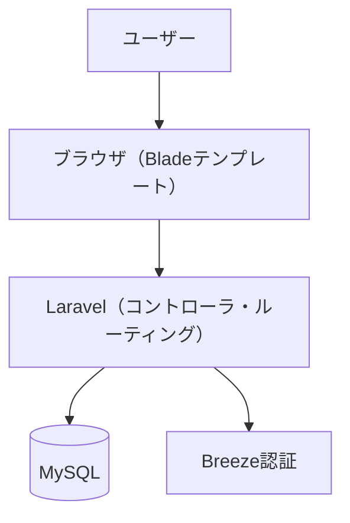
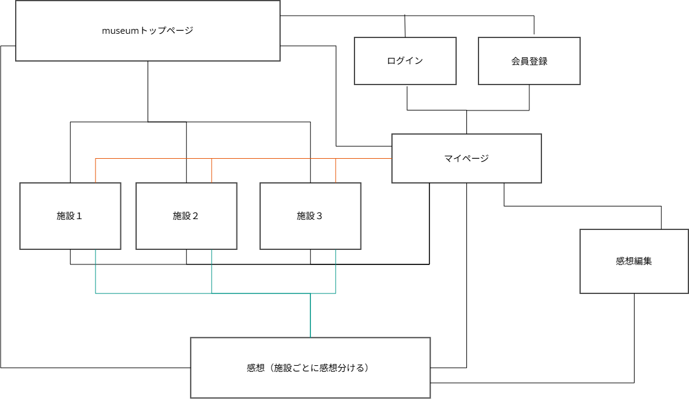
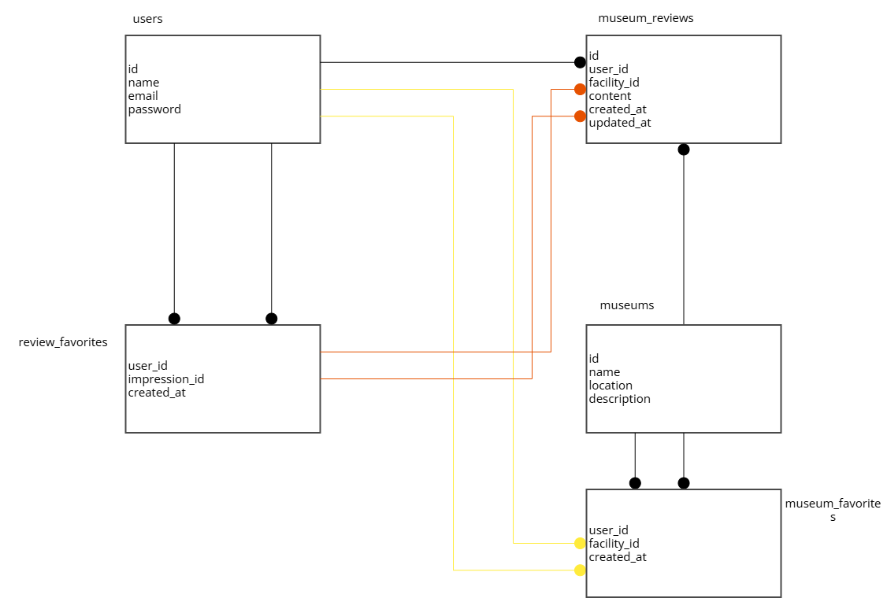

# Museum - 美術館・展覧会レビュー共有サービス

## サービス概要

**Museum** は、美術館・展覧会に関する情報を管理・共有できるレビュー型Webアプリケーションです。  
全国の美術館に対する訪問履歴や感想を記録し、他のユーザーと共有できる仕組みを備えています。

### 主な機能

- 美術館の一覧表示と、施設ごとの特別展（企画展）の表示
- ユーザー登録・ログイン機能（Breeze を使用）
- 展覧会に対する「行った」記録、および感想投稿
- 展覧会・感想へのお気に入り登録機能
- マイページでの訪問履歴・お気に入り・投稿管理
- 他ユーザーの感想の閲覧と共感
- ポリシーによる投稿編集権限の制御（本人のみ可能）

---

## 🧭 概要設計（アーキテクチャ図）

---

## 🗺️ サイトマップ（画面遷移図）

## 🧩 データベース構成（ER図）

---

## 公開デモ

🔗 https://museum.fly.dev/

---

## 🔗 公開URLまとめ

- 🔍 GitHub Pages 紹介ページ  
  https://umatoma113.github.io/museum/

- 🚀 本番アプリ（Laravel + Fly.io）  
  https://museum-app.fly.dev

- 💻 ソースコード（GitHub）  
  https://github.com/umatoma113/museum

---

## 使用技術スタック

| 分類         | 技術                              |
|--------------|-----------------------------------|
| フレームワーク | PHP 8.x / Laravel 10.x            |
| フロント     | Blade（HTML / CSS / JavaScript） |
| 認証         | Laravel Breeze                    |
| データベース | MySQL（ローカル or Fly.io）       |
| デプロイ     | Fly.io（無料プラン使用）           |

---

